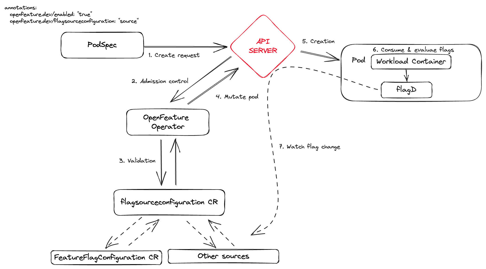

<picture>
  <source media="(prefers-color-scheme: dark)" srcset="./images/openfeature-horizontal-white.svg">
  <source media="(prefers-color-scheme: light)" srcset="./images/openfeature-horizontal-black.svg">
  
</picture>


[](https://artifacthub.io/packages/search?repo=open-feature-operator)
[](https://bestpractices.coreinfrastructure.org/projects/6615)
[](https://app.fossa.com/projects/git%2Bgithub.com%2Fopen-feature%2Fopen-feature-operator?ref=badge_shield)

The OpenFeature Operator is a Kubernetes native operator that allows you to expose feature flags to your applications. It injects a [flagD](https://github.com/open-feature/flagd) sidecar into your pod and allows you to poll the flagD server for feature flags in a variety of ways.

## Deploy the latest release

_Requires [cert manager](https://cert-manager.io/docs/installation/kubernetes/) installed (see why [here](#cert-manager))_

<!---x-release-please-start-version-->

```
kubectl create namespace open-feature-operator-system
kubectl apply -f https://github.com/open-feature/open-feature-operator/releases/download/v0.2.6/release.yaml
```

<!---x-release-please-end-->


## Deploy the helm chart

```
git clone https://github.com/open-feature/open-feature-operator.git
cd chart
helm upgrade ofo . --install -n open-feature-operator-system
```


### Release contents

- `release.yaml` contains the configuration of:
  - `FeatureFlagConfiguration` `CustomResourceDefinition` (custom type that holds the configured state of feature flags).
  - Standard kubernetes primitives (e.g. namespace, accounts, roles, bindings, configmaps).
  - Operator controller manager service.
  - Operator webhook service.
  - Deployment with containers kube-rbac-proxy & manager.
  - `MutatingWebhookConfiguration` (configures webhooks to call the webhook service).

### How to deploy a flag consuming application

_Prerequisite: the release and certificates have been deployed as outlined above._

Deploying a flag consuming application requires (at minimum) the creation of the following 2 resources (an example can be found [here](./config/samples/end-to-end.yaml)):

#### FeatureFlagConfiguration

This is a `CustomResourceDefinition` which contains the feature flags specification and a name of the spec.

#### Deployment (or Statefulset/Daemonset)

This is a kubernetes primitive for deploying an application. The metadata annotations must include `openfeature.dev/featureflagconfiguration`
with the value set as the name of the `FeatureFlagConfiguration` created in the step prior.

e.g.
```
metadata:
  annotations:
    openfeature.dev/featureflagconfiguration: "demo"
```

## Architecture

As per the issue [here](https://github.com/open-feature/ofep/issues/1)

As per v0.1.1, the default sync provider has been optimized as per this OpenFeature Enhancement Proposal [issue](https://github.com/open-feature/ofep/blob/main/004-OFEP-kubernetes-sync-service.md).

High level architecture is as follows:



### Requirements

#### Namespace

The Kubernetes resources created by OpenFeature Operator are under the `open-feature-operator-system` namespace. This means
any resources that want to communicate with the OFO system (e.g. an application calling flag evaluations) must fall under
this namespace.

#### Cert Manager

OpenFeature Operator is a server that communicates with Kubernetes components within the cluster, as such it requires a means of
authorizing requests between peers. [Cert manager](https://cert-manager.io/) handles the authorization by
adding certificates and certificate issuers as resource types in Kubernetes clusters, and simplifies the process of
obtaining, renewing and using those certificates.

## Example

When wishing to leverage feature flagging within the local pod, the following steps are required:

1. Create a new feature flag custom resource.

_See [here](config/samples/crds/custom_provider.yaml) for additional custom resource parameters_

```
apiVersion: core.openfeature.dev/v1alpha1
kind: FeatureFlagConfiguration
metadata:
  name: featureflagconfiguration-sample
spec:
  featureFlagSpec: |
    {
      "flags": {
        "foo": {
          "state": "ENABLED",
          "variants": {
            "bar": "BAR",
            "baz": "BAZ"
          },
          "defaultVariant": "bar",
          "targeting": {}
        }
      }
    }
```

1. Reference the CR within the pod spec annotations

```
apiVersion: v1
kind: Pod
metadata:
  name: nginx
  annotations:
    openfeature.dev: "enabled"
    openfeature.dev/featureflagconfiguration: "featureflagconfiguration-sample"
spec:
  containers:
  - name: nginx
    image: nginx:1.14.2
    ports:
    - containerPort: 80
```

3. Example usage from host container

```
root@nginx:/# curl -X POST "localhost:8013/schema.v1.Service/ResolveString" -d '{"flagKey":"foo","context":{}}' -H "Content-Type: application/json"
{"value":"BAR","reason":"DEFAULT","variant":"bar"}
```

### Running the operator locally

#### Create a local cluster with cert manager and our operator

1.  Create a local cluster with MicroK8s or Kind (forward requests from your localhost:30000 to your cluster, see MicroK8s/Kind doc)
1.  `IMG=ghcr.io/open-feature/open-feature-operator:main make deploy-operator`

#### Run the example

1. Apply the end-to-end example: `kubectl -n open-feature-operator-system apply -f config/samples/end-to-end.yaml`
1. Visit `http://localhost:30000/`
1. Update the value of the `defaultVariant` field in the custom resource instance in `config/samples/end-to-end.yaml` and re-apply to update the flag value!
1. Visit `http://localhost:30000/` and see the change!

## Releases

This repo uses _Release Please_ to release packages. Release Please sets up a running PR that tracks all changes for the library components, and maintains the versions according to [conventional commits](https://www.conventionalcommits.org/en/v1.0.0/), generated when [PRs are merged](https://github.com/amannn/action-semantic-pull-request). When Release Please's running PR is merged, any changed artifacts are published.


## License
[](https://app.fossa.com/projects/git%2Bgithub.com%2Fopen-feature%2Fopen-feature-operator?ref=badge_large)