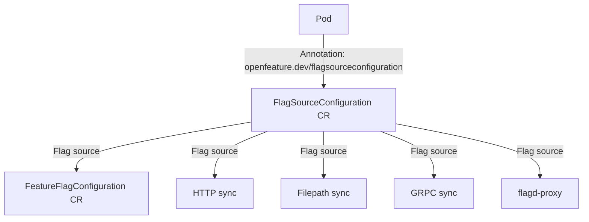

# Documentation

This directory contain OpenFeature Operator documentation. 

A quick start ? Follow the quick start to get OpenFeature Operator up and running in your cluster within 5 minutes.

- [Quick Start](./quick_start.md)

## Detailed Usage

Follow the documentation below to deploy the open feature operator to your local cluster, followed by a simple example app using `curl` to evaluate a static flag.

- [Installation](./installation.md)
- [Getting Started](./getting_started.md)

## Configuration

Configuration of the deployed sidecars is handled through the `FeatureFlagConfiguration` custom resources defined in the `openfeature.dev/featureflagconfiguration` annotation of a deployed `PodSpec`.

The relationship of the configuration is highlighted in the diagram below,

To configure and understand more,

- [Annotations](./annotations.md)
- [FlagSourceConfiguration](./flag_source_configuration.md)
- [FeatureFlagConfigurations](./feature_flag_configuration.md)

## Other Resources
- [Permissions](./permissions.md)
- [Development Notes](./development_notes.md)
- [flagd Kube Proxy](./flagd_proxy.md)
- [Threat model](./threat_model.md)
- [API Reference](./crds.md)