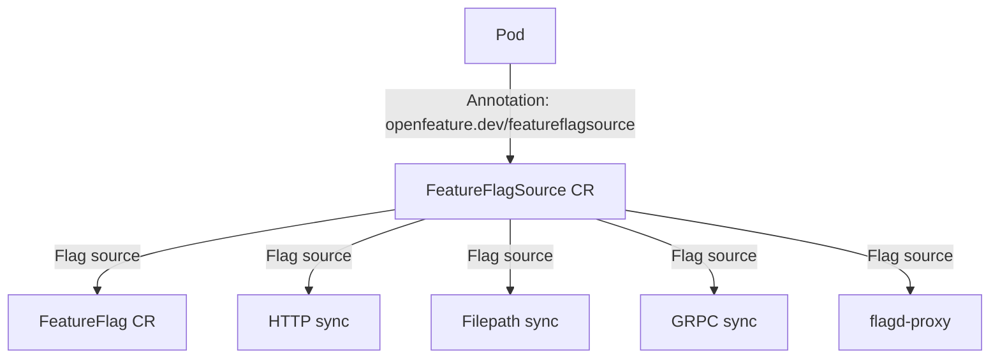

# Documentation

This directory contains OpenFeature Operator documentation.

Interested in having OpenFeature Operator up and running within 5 minutes? Follow the quick start guide found below.

- [Quick Start](./quick_start.md)

Follow the detailed installation guide to deploy open feature operator to your local cluster.

- [Installation](./installation.md)

## Configuration

Configuration of the deployed sidecars is handled through the `FeatureFlagSource` custom resources referenced via `openfeature.dev/featureflagsource` annotations of the deployed `PodSpec`.

The relationship between the deployment and custom resources is highlighted in the diagram below,

To configure and understand more,

- Deployment configurations: [Annotations](./annotations.md)
- Define flag sources for the deployment: [FeatureFlagSource](./feature_flag_source.md)
- Define feature flags as custom resource: [FeatureFlags](./feature_flag.md)

## Other Resources
- [Permissions](./permissions.md)
- [Concepts](./concepts.md)
- [Development Notes](./development_notes.md)
- [Threat model](./threat_model.md)
- [flagd Kube Proxy](./flagd_proxy.md)
- [API Reference](./crds.md)