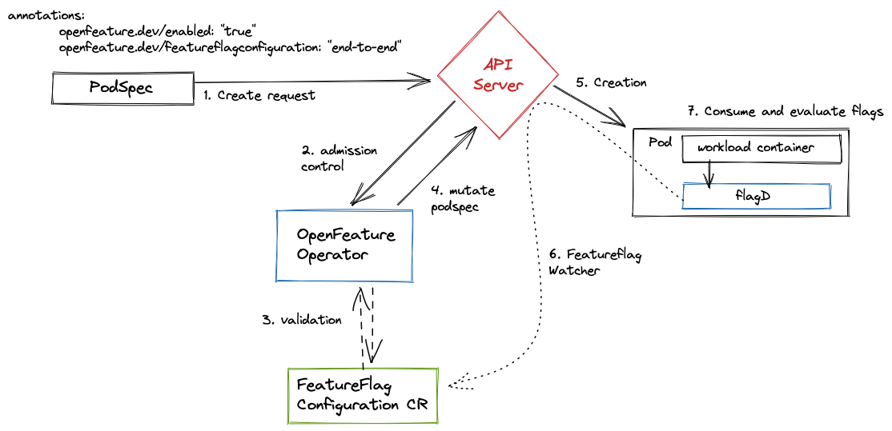

# Concepts

This document covers some key concepts related to the OpenFeature operator (OFO).

For general OpenFeature or feature flag concepts, see our [online documentation](https://openfeature.dev/docs/reference/intro).

## Architecture

The high level architecture of the operator is as follows:  

    

## Modes of flag syncs

- Kubernetes:  sync configuration which configures injected flagd sidecar instances to monitor the Kubernetes API 
  for changes in flag configuration custom resources (`FeatureFlagConfiguration`).
- filepath:  sync configuration which creates and mounts ConfigMap files from flag configuration custom  resources
  (`FeatureFlagConfiguration`) and configures injected flagd sidecar instances to monitor them.
- grpc: sync configuration which listen for flagd compatible grpc stream
- http: sync configuration which watch and periodically poll flagd compatible http endpoint
- [flagd-proxy](./flagd_proxy.md)

Each approach have their advantages and disadvantages. 

The `kubernetes`, `grpc` and `flagd-proxy` sync configuration has the advantage of providing near real-time flag updates (on the order of seconds) to the flagd sidecar. 

The `kubernetes` syncs require the flagd sidecar (and consequently the workload pod) to communicate with the 
Kubernetes API. To satisfy this requirement, the OpenFeature Operator registers a [mutating admission webhook](https://kubernetes.io/docs/reference/access-authn-authz/extensible-admission-controllers/)
that changes the manifest of Pods annotated with [OpenFeature annotations](./annotations.md) and adds a `ClusterRoleBinding`
to the `ServiceAccount` of the Pod. This may violate the security or network policies of some organizations.

Furthermore, if you're using GitOps to deliver your application, please ensure that the `ClusterRoleBinding` deployed with the application
are not reconciled. Otherwise, the changes made by the Operator will be reverted, and the injected [flagD](https://github.com/open-feature/flagd) won't be
able to fetch Feature Flag information. For further information on how to avoid reconciling specific resources, you can check
[Argo](https://argo-cd.readthedocs.io/en/stable/user-guide/diffing/#application-level-configuration) and
[Flux](https://fluxcd.io/flux/components/source/gitrepositories/#excluding-files) documentation pages.

**When deploying an application via GitOps, we recommend using the `flagd-proxy` mode, which doesn't suffer from the shortcomings above.**

The `"filepath"` provider requires no such communication, but relies on the fact that [Kubernetes automatically updates mounted ConfigMaps](https://kubernetes.io/docs/concepts/configuration/configmap/#mounted-configmaps-are-updated-automatically). 
The disadvantage of this approach is that flag configuration updates may take as long as two minutes to propagate, depending on cluster configuration:

> "the total delay from the moment when the ConfigMap is updated to the moment when new keys are projected to the Pod can be as long as the kubelet sync period + cache propagation delay"

Consider your individual requirements and select the configuration most appropriate for your needs.