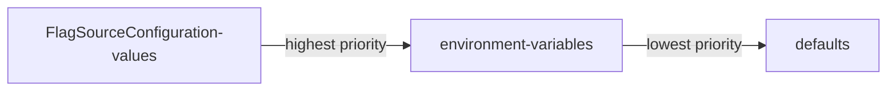

# Flag Source configuration

The injected sidecar is configured using the `FlagSourceConfiguration` custom resource definition. 
The `openfeature.dev/flagsourceconfiguration` annotation is used to assign Pods with their respective`FlagSourceConfiguration` CRs.

The annotation value is a comma separated list of values following one of two patterns: {NAME} or {NAMESPACE}/{NAME}. 
If no namespace is provided, it is assumed that the CR is within the same namespace as the deployed pod, for example:

```yaml
    metadata:
        namespace: test-ns
        annotations:
            openfeature.dev/enabled: "true"
            openfeature.dev/flagsourceconfiguration: "config-A, test-ns-2/config-B"
```

In this example, 2 CRs are being used to configure the injected container (by default the operator uses the `flagd:main` image), `config-A` (which is assumed to be in the namespace `test-ns`) and `config-B` from the `test-ns-2` namespace, with `config-B` taking precedence in the configuration merge.

The `FlagSourceConfiguration` version `v1alpha3` CRD defines a CR with the following example structure, the documentation for this CRD can be found [here](crds.md#flagsourceconfiguration):

```yaml
apiVersion: core.openfeature.dev/v1alpha3
kind: FlagSourceConfiguration
metadata:
    name: flag-source-sample
spec:
    metricsPort: 8080
    Port: 80
    evaluator: json
    image: my-custom-sidecar-image
    defaultSyncProvider: filepath
    tag: main
    sources:
    - source: namespace/name
      provider: kubernetes
    - source: namespace/name2
    - source: not-a-real-host.com
      provider: http
    envVars:
    - name: MY_ENV_VAR
      value: my-env-value
    probesEnabled: true
    debugLogging: false
```

The relevant `FlagSourceConfigurations` are passed to the operator by setting the `openfeature.dev/flagsourceconfiguration` annotation, and is responsible for providing the full configuration of the injected sidecar.

## Configuration Merging

When multiple `FlagSourceConfigurations` are provided, the configurations are merged. The last `CR` takes precedence over the first, with any configuration from the deprecated `FlagDSpec` field of the `FeatureFlagConfiguration` CRD taking the lowest priority. 





An example of this behavior:
```
    metadata:
        annotations:
            openfeature.dev/enabled: "true"
            openfeature.dev/flagsourceconfiguration:"config-A, config-B"
```
Config-A:
```
apiVersion: core.openfeature.dev/v1alpha2
kind: FlagSourceConfiguration
metadata:
    name: config-A
spec:
    metricsPort: 8080
    tag: latest
```
Config-B:
```
apiVersion: core.openfeature.dev/v1alpha2
kind: FlagSourceConfiguration
metadata:
    name: config-B
spec:
    port: 8000
    tag: main
```
Results in the following configuration:
```
spec:
    metricsPort: 8080
    port: 8000
    tag: main
```