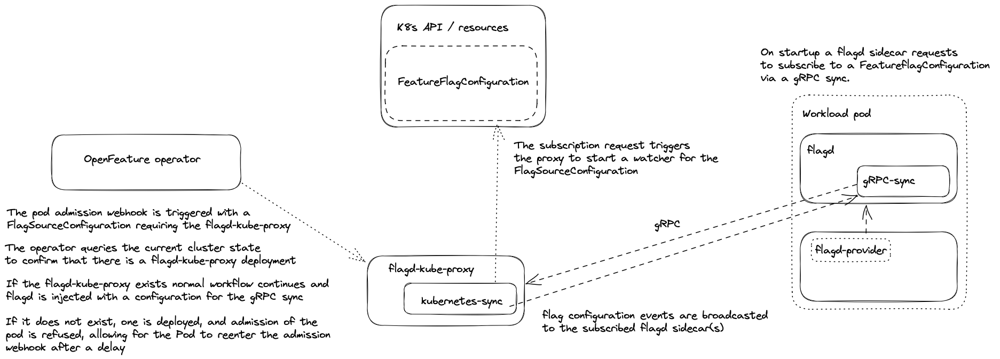

# flagd-proxy

> The flagd kube proxy is currently in an experimental state

The `flagd-proxy` is a pub/sub for mechanism watching configuration changes in `FeatureFlag` CRs.
This source type avoids the need for additional cluster wide permissions in the workload pod, and reduces load on the k8s API.
In order for a pod to have the required permissions to watch a `FeatureFlag` CR in the default implementation, it must have its service account appended to the `flagd-kubernetes-sync` role binding, the details for this role can be found [here](./permissions.md).
In some use cases this may not be favorable, in these scenarios the alternative `flagd-proxy` implementation may be used.

The `flagd-proxy` bypasses the widespread permissions issue by acting as the single source of truth for subscribed flagd instances, broadcasting configuration changes to all subscribed pods via gRPC streams.
For each requested `FeatureFlag` a new ISync implementation is started, and closed once there are no longer any listeners.
This results in only one set of resources requiring the `flagd-kubernetes-sync` permissions, tightening the restrictions on all other pods.

## Architecture

The diagram below describes the high level architecture and implementation of the `flagd-proxy`

<p align="center">
    
</p>

The `flagd-proxy` is only deployed once the reconcile loop for a `FeatureFlagSource` is run with a CR containing the provider `"flagd-proxy"` in its source array.

## Implementation

Update the end-to-end test in `/config/samples/end-to-end.yaml` to use the `"flagd-proxy"` provider, the source should be a `namespace/name`.

```diff
apiVersion: core.openfeature.dev/v1beta1
kind: FeatureFlagSource
metadata:
  name: end-to-end
  namespace: open-feature-demo
spec:
  sources:
-  - source: open-feature-demo/end-to-end
-    provider: kubernetes
+  - source: open-feature-demo/end-to-end
+    provider: flagd-proxy
```

Deploy the end-to-end demo, this will result in the deployment of the `flagd-proxy` and the required configuration set to the injected flagd sidecar.
The end result will be identical to the original end-to-end demo, however the `open-feature-demo-sa` will not be added to the `flagd-kubernetes-sync` role binding.

```sh
kubectl apply -f config/samples/end-to-end.yaml
```

## Configuration

The current implementation of the `flagd-proxy` allows for a set of basic configurations.

| Environment variable      | Behavior                                                                                      |
|---------------------------|-----------------------------------------------------------------------------------------------|
| FLAGD_PROXY_IMAGE         | Allows for the default flagd-proxy image to be overwritten                                    |
| FLAGD_PROXY_TAG           | Allows for the default flagd-proxy tag to be overwritten                                      |
| FLAGD_PROXY_Replicas      | Allows to configure the number of replicas for the flagd-proxy deployment.                    |
| FLAGD_PROXY_PORT          | Allows the default port of `8015` to eb overwritten                                           |
| FLAGD_PROXY_METRICS_PORT  | Allows the default metrics port of `8016` to be overwritten                                   |
| FLAGD_PROXY_DEBUG_LOGGING | Defaults to `"false"`, allows for the `--debug` flag to be set on the `flagd-proxy` container |

## Resource Ownership

On deployment, the `flagd-proxy` `Deployment` will be configured with the `open-feature-operator-controller-manager` `Deployment` as its owner resource.
As such the `flagd-proxy` and its associated `Service` will be garbage collected when the operator is uninstalled.