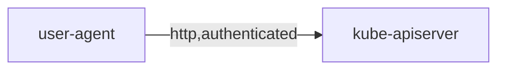
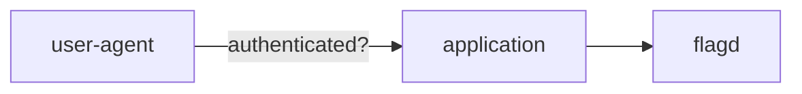
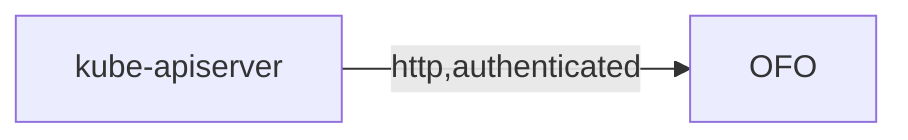
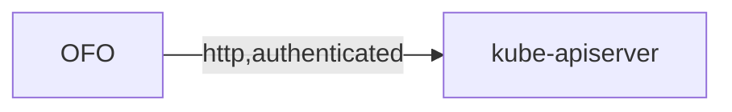
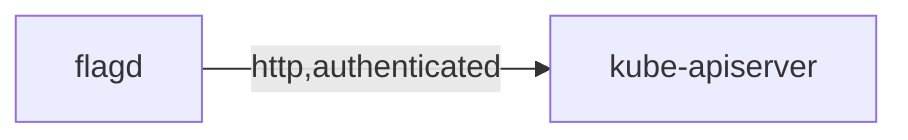
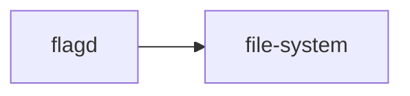
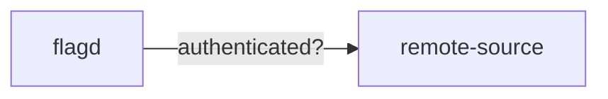
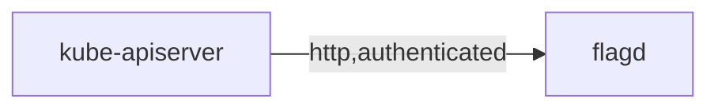
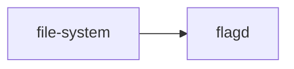

# Threat Model

Threat modeling is a structured approach of identifying and prioritizing potential threats to a system, and determining the value that potential mitigations would have in reducing or neutralizing those threats.

Using [OWASP's threat modeling cheat sheet for guidance](https://cheatsheetseries.owasp.org/cheatsheets/Threat_Modeling_Cheat_Sheet.html).

## Application Entry Points

The interfaces through which potential attackers can interact with the application or supply them with data.
The diagram below models these interfaces (when configured to use the kubernetes sync provider), the sections that follow describe them further.

### Via the application to which OpenFeature Operator (OFO) injects the flagd sidecar

OFO appends `flagd` as a sidecar container to any pod spec application with valid annotations. The application is then able to evaluate flags by calling `flagd` (typically via an sdk and flag provider) using whichever configured protocol (REST/gRPC/socket, with or without TLS). While a caller of the application could be from a trusted entity (internal infrastructure), it is more prudent to presume the agent to be untrusted (and using any protocol which the application allows).

### Via the Kubernetes API server

OFO listens to webhooks from the Kubernetes control plane (its API server), specifically it handles mutations of pods.
It parses the mutated pod's annotations to determine which CRD to retrieve flagd's flag configuration from, mutating flagd's internal state if necessary.

## Assets

### Flag source configuration custom resource (CR)

Stored in the kubernetes cluster's etcd instance, this custom resource contains the configuration for the sidecar container (`flagd`) `OFO` appends to the application pod(s).

### Flag configuration CR

Stored in the kubernetes cluster's etcd instance, this custom resource contains the sidecar's (`flagd`) feature flags configuration. It also incorporates configuration for the sidecar container (`flagd`), although, this is deprecated and superseded by the flag source configuration CR.
The feature flags configurations may contain personally identifiable information (used in targeting rules e.g. email domain). They generally should not contain any sort of secret.

### Environment variables

Stored in `OFO`'s container's registry, these variables are used to configure the flag source if not declared explicitly by the flag source configuration CR or flag configuration CR.

### flagd flag configuration

`flagd`'s flag configuration is the determinant of the response to any flag request, it is stored in `flagd`'s memory.
There are numerous ways to set and maintain this state, configured by the [flag configuration CR](#flag-configuration-cr):
- Within the flag configuration CR (kubernetes sync provider)
- As a file (filepath provider)
- From a remote source (http provider)

### Personally identifiable information

PII may be used in flag evaluation, this data never leaves the node or is persisted.

## Controls

### External actions

#### Cluster state mutation

The user-agent (e.g. cluster admin or developer) is typically (and therefore assumed to be) internal to the intranet. They make authenticated http requests to the `kubeapi-server` to mutate the state of the cluster.
Pertinent requests are
1. Mutation of pods, this fires a [webhook](#webhooks) to `OFO`.
2. Mutation of flag configuration CR, fires a [webhook](#webhooks) to `OFO` & is picked up as an event by `flagd` (if configured).

The data in transit is at threat of tampering, the security control is authentication.

#### Feature flag request

The user-agent (e.g. web browser) is typically (and therefore assumed to be) external to the intranet. They make (potentially authenticated) requests (subject to tampering) to the application to which `OFO` sidecars `flagd`. Internally, the application (typically) uses an `OpenFeature SDK` (dependent on the application's programming language) alongside a `flagd-provider` to make feature flag requests.

### Internal actions

#### Webhooks

1. As a result of [the mutation of pods](#cluster-state-mutation), `OFO` receives an authenticated http request notifying it of the pod. `OFO` queries (authenticated http) the pod's annotations to determine whether it needs to take action. If satisfactory, `OFO` further [mutates the state of the pod](#pod-mutation).
2. As a result of [the mutation of flag configuration CR](#cluster-state-mutation), `OFO` receives an authenticated http request notifying it of the flag configuration CR. `OFO` asserts that the CR is valid.

The data in transit is at threat of tampering, the security control is authentication.

#### Pod mutation

As a result of [the mutation of pods webhook](#webhooks), `OFO` appends `flagd` to the pod's containers (this is known as the "sidecar" pattern) and sends (authenticated http request) the pod's configuration back to the kube-apiserver. `flagd` is [configured](#flagd-flag-configuration) based on the pod's annotated flag configuration CR. If the CR is configured to use the filepath provider, a ConfigMap is created containing the flag configuration and mounted as a volume to the `flagd` container (this file is subsequently watched by `flagd`).
The data in transit is at threat of tampering, the security control is authentication.

#### flagd state configuration

##### kubernetes sync provider

`flagd` makes an authenticated http request to retrieve its initial flag configuration state from the CR. Subsequently, it registers an event handler to listen to changes to the CR. The configuration is at threat of information disclosure and tampering, the security control is authentication.

##### filepath sync provider

`flagd` opens a file watcher on its configured file path, mutating its internal state to mirror the flag configuration file. The file is at threat of information disclosure and tampering, the security control is that the file is only accessible by the `flagd` container and data transit is contained within the `flagd` container.

##### http sync provider

`flagd` polls a remote endpoint over http for a flag configuration, mutating its internal state to mirror the response. The data is at threat of information disclosure and tampering, the security control is authentication (if used).

#### flagd event handling

##### kubernetes sync provider

`flagd` listens to changes of its registered CR, mutating its internal state to mirror the change. The data is at threat of information disclosure and tampering, security control is authentication.

##### filepath sync provider

`flagd` listens to changes of its registered file, mutating its internal state to mirror the change. The data is at threat of information disclosure and tampering, the security control is that the file is only accessible by `flagd` container and data transit is contained within `flagd` container.
