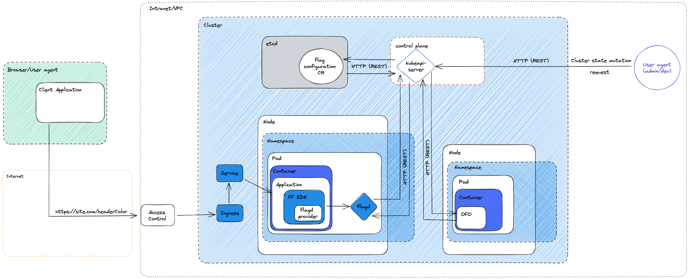
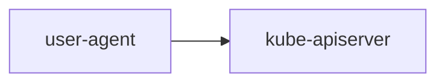
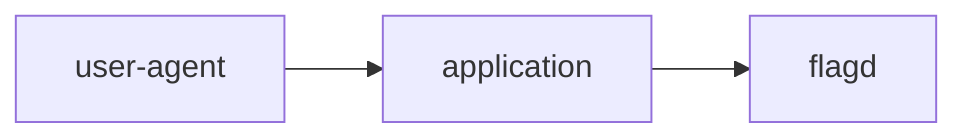
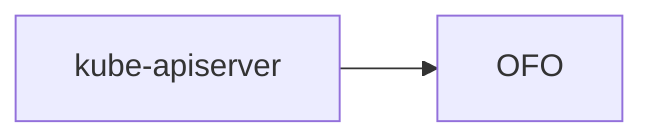
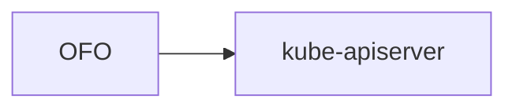
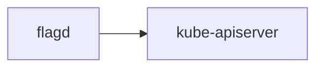
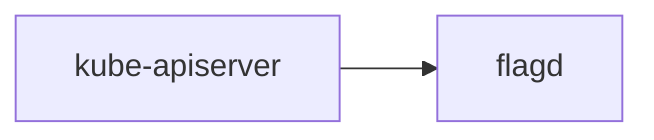

# Threat Model

Threat modeling is a structured approach of identifying and prioritizing potential threats to a system, and determining the value that potential mitigations would have in reducing or neutralizing those threats.

Using [OWASP's threat modeling cheat sheet for guidance](https://cheatsheetseries.owasp.org/cheatsheets/Threat_Modeling_Cheat_Sheet.html).

## Application Entry Points

The interfaces through which potential attackers can interact with the application or supply them with data.
The diagram below models these interfaces, the sections that follow describe them further.

### Via the application to which OpenFeature Operator (OFO) injects the flagd sidecar

OFO appends flagd as a sidecar container to any pod spec application with valid annotations. The application is then able to evaluate flags by calling flagd (typically via an sdk and flag provider). While a caller of the application could be from a trusted entity (internal infrastructure), it is more prudent to presume the agent to be untrusted.

### Via the Kubernetes API server

OFO listens to webhooks from the Kubernetes control plane (its API server), specifically it handles mutations of pods.
It parses the mutated pod's annotations to determine which CRD to retrieve flagd's flag configuration from, mutating flagd's internal state if necessary.

## Assets

### Flag source configuration custom resource (CR)

Stored in the kubernetes cluster's etcd instance, this custom resource contains the configuration for the sidecar container (`flagd`) `OFO` appends to the application pod(s).

### Flag configuration CR

Stored in the kubernetes cluster's etcd instance, this custom resource contains the sidecar's (`flagd`) feature flags configuration. It also incorporates configuration for the sidecar container (`flagd`), although, this is deprecated and superseded by the flag source configuration CR.

### Environment variables

Stored in `OFO`'s container's registry, these variables are used to configure the flag source if not declared explicitly by the flag source configuration CR or flag configuration CR.

### flagd flag configuration

`flagd`'s flag configuration is the determinant of the response to any flag request, it is stored in `flagd`'s memory.
There are numerous ways to set and maintain this state, configured by the flag configuration CR:
- Within the flag configuration CR 
- As a file
- From a remote source

## Controls

### External agency

#### Cluster state mutation

The user-agent is typically (and therefore assumed to be) internal to the intranet. They make requests to the `kubeapi-server` to mutate the state of the cluster.
Pertinent requests are
1. Mutation of pods, this fires a [webhook](#webhooks) to `OFO`.
2. Mutation of flag configuration CR, fires a [webhook](#webhooks) to `OFO` & is picked up as an event by `flagd` (if configured).

#### Feature flag request

The user-agent (e.g. web browser) is typically (and therefore assumed to be) external to the intranet. They make requests to the application to which `OFO` sidecars `flagd`. Internally, the application (typically) uses an `OpenFeature sdk` (dependent on the application's programming language) alongside a `flagd-provider` to make feature flag requests.

### Internal agency

#### Webhooks

1. As a result of [the mutation of pods](#cluster-state-mutation), `OFO` receives a request notifying it of the pod. `OFO` queries the pod's annotations to determine whether it needs to take action. If satisfactory, `OFO` further [mutates the state of the pod](#pod-mutation).
2. As a result of [the mutation of flag configuration CR](#cluster-state-mutation), `OFO` receives a request notifying it of the flag configuration CR. `OFO` asserts that the CR is valid.

#### Pod mutation

As a result of [the mutation of pods webhook](#webhooks), `OFO` appends `flagd` to the pod's containers. `flagd` is configured based on the pod's annotated flag configuration CR.

#### flagd state configuration

Not applicable if `flagd` is not configured to use the kubernetes sync provider.
`flagd` makes a request to retrieve its initial flag configuration state from the CR. Subsequently, it registers an event handler to listen to changes to the CR.

#### flagd event handling

Not applicable if `flagd` is not configured to use the kubernetes sync provider.
`flagd` listens to changes of its registered CR, mutating its internal state to mirror the change.

